# Software Quality Exam - MTOGO Application 

Evidence of different tests made in both the Legacy System and the new Microservice solution, can be found in this README file as well as our choice of code patterns and examples of how we have used this in our code 

## Legacy System 

### Evidence of tests

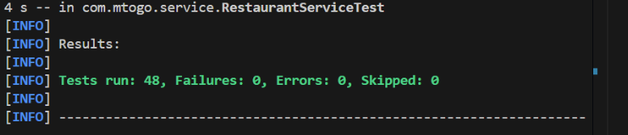

The full automated test suite was executed using the: 

* mvn test command.

This command ran all JUnit 5 tests, including Mockito-based unit tests, MockMvc controller tests, and H2-backed integration tests, as part of the Maven test lifecycle.

A total of 48 tests were executed, with zero failures, zero errors, and zero skipped tests, which confirms that all implemented unit, controller, and integration tests passed successfully.

The Spring test profile is a configuration used only during testing.
It allows the application to run with test-specific settings, such as an H2 in-memory database, instead of production ressources like MySQL.

Using the test profile, the following tests were executed:
* JUnit 5 unit tests for service-layer business logic
* Mockito-based mocked dependency tests
* MockMvc controller and API tests
* Integration tests using an H2 in-memory database

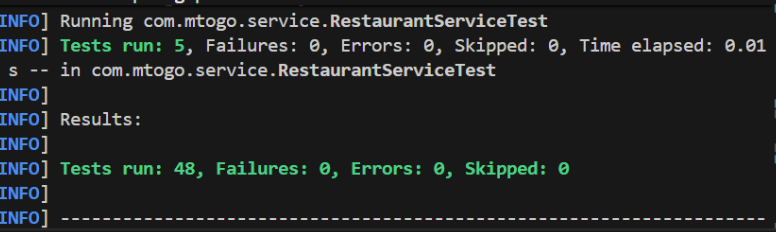

Code Coverage Results (JaCoCo): 

* mvn -Dspring.profiles.active=test clean test

Code Coverage Analysis
JaCoCo was used to measure test coverage during automated test execution.
The final coverage report shows 75% instruction coverage and 63% branch coverage in the service layer, exceeding the defined minimum coverage requirement of 65% in the test strategy and test plan.
Coverage analysis focused on bcritical business logic in the service layer rather than boilerplate code such as DTOs, configuration classes, and simple mapping logic.
This approach ensures meaningful coverage that reflects real application risk.

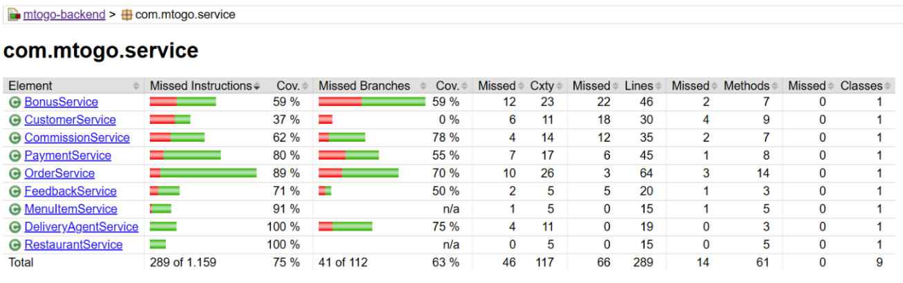

Static code analysis:

* mvn pmd:check

Static code analysis was performed using PMD to identify potential code quality issues such as duplicated code, unused variables, and design violations.
The analysis was executed via Maven using the commands: 
* mvn pmd:check 
and
* mvn pmd:pmd.
The PMD execution completed successfully, and no critical violations were detected here. 

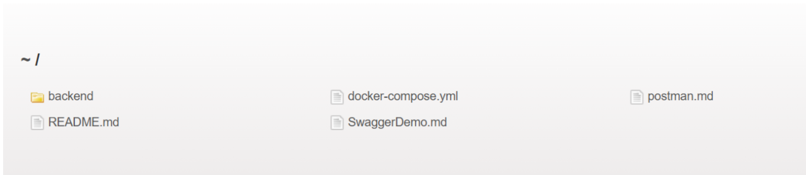

#### System Testing (End-to-End)
System testing was performed manually using Swagger UI and Postman.
The application was started locally, and REST API endpoints were executed following the complete business workflow.
The tested flow included customer creation, order placement, payment processing, and feedback submission.
Each step returned the expected HTTP responses and successfully triggered the next stage of the workflow.

#### Acceptance Testing (Business Flows)
Acceptance testing validated predefined business scenarios against functional requirements.
The primary business flow Order -> Payment -> Delivery -> Feedback was executed manually using Swagger UI and Postman.
The observed results matched the expected business behavior, which confirmed that the core requirements, such as order status transitions, payment handling, and feedback constraints were correctly implemented.

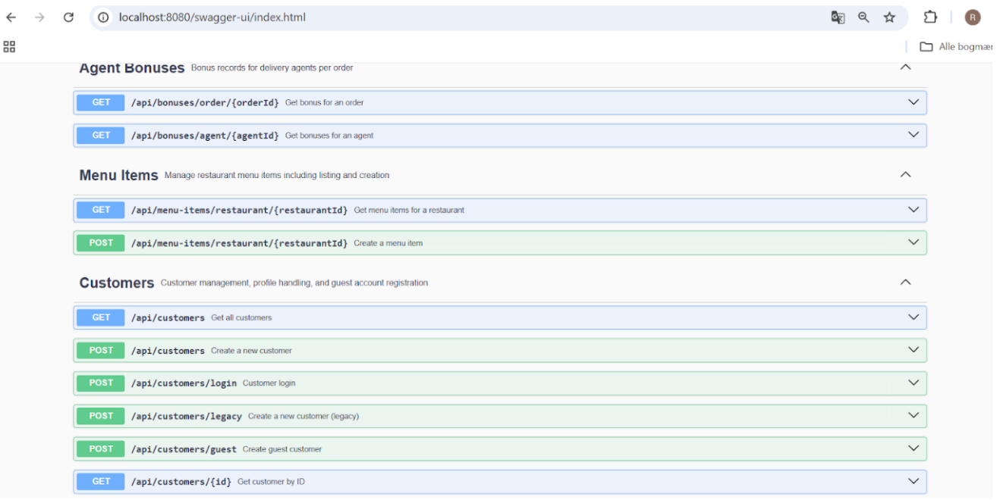

#### Peer Review Note – Customer Classes
A peer review was done with a group member focusing on customer-related logic. The review compared expected behavior with the current implementation and resulted in agreed improvements.

Scope
* CustomerService
* CustomerServiceTest

Before (review observations)
* CustomerService.getCustomerById(Long) returned null when a customer did not exist.
* Tests expected null for missing customer IDs.

After (applied changes)
* CustomerService.getCustomerById(Long) now throws an IllegalArgumentException when a customer is not found.
* Tests were updated to expect the exception on missing IDs.
* A positive-path test was added to validate correct DTO mapping for a valid customer ID.

#### Refactoring without Regression
A small refactoring was performed in the customer service logic to improve error handling by replacing a null return value with a meaningful exception when a customer is not found. Corresponding unit tests were updated and expanded to reflect the new behavior. After the refactoring, the full automated test suite was re-executed successfully, confirming that no regressions were introduced.

## Microservices

### Financial Microservice

To run only the tests related to the Financial Service, navigate to the `financial-service` directory and execute the command below, but the tests are also run automatically in the pipeline:

* mvn test

The Financial Microservice is not yet fully tested but a substanstial amount of the functionality and business logic has been tested. 

The JaCoCo report shows:

Most of the testing has been to evaluate the commissions model with equivalence partitioning and boundary value analysis (explanation will follow) because a lot of the business logic for this Microservice has been within this model. 

In total 32 tests has passed: 

#### Equivalence Partitioning and Boundary Value Analysis 

The `CommissionCalculatorTest` class uses equivalence partitioning and boundary value analysis to verify that commission and fee calculations in the Financial Microservice behave correctly under normal circumstances and edge case circumstances.

#### Commission Model Explanation
The commission calculation used by the MTOGO system is based on an incremental fee structure rather than a flat percentage.

The total amount for each order is divided into defined ranges, and within each range, a different commission rate is charged:

- The first 100 of the order amount is 6% that goes to MTOGO
- The portion from 101 to 500 is 5% that goes to MTOGO
- The portion from 501 to 1000 is 4% that goes to MTOGO
- Any amount above 1000 is 3% that goes to MTOGO

#### Example: Order Amount = 700
- 6% is applied to the first 100
- 5% is applied to the portion from 101 to 500
- 4% is applied to the portion from 501 to 700

#### Equivalence Partitions (EP)

| EP  | Order Amount Range |
|-----|--------------------|
| EP1 | ≤ 100 |
| EP2 | 101 – 500 |
| EP3 | 501 – 1000 |
| EP4 | > 1000 |

Random values from each partition are tested to ensure correct commission calculations within each range.

#### Boundary Value Analysis (BVA)

| Boundary Case | Order Amount |
|--------------|--------------|
| Edge Case 1 | 100 |
| Edge Case 2 | 500 |
| Edge Case 3 | 1000 |

The tests include:
- Boundary values
- Values just below the boundary
- Values just above the boundary

This ensures correct behavior when commission calculation rules changes. 

#### PMD report in Financial Microservice

The PMD report from the Financial Microservice is almost clean, with the exception of one priority 3 violation that we didnt find neccesary to change.
In the first PMD report there were about 30 violations - most of the issues were low priority, such as empty constructors without documentation or code that was not written cleanly, even though it functioned correctly. 
The PMD report helped to solve these issues and make the code cleaner and more safe. 

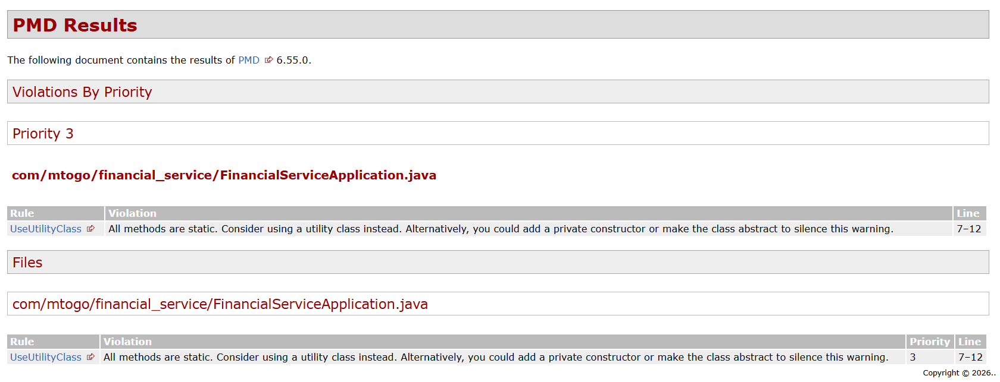

## Design Patterns used in MTOGO Application

#### Adapter Design Pattern
Type: Structural Pattern
Purpose: To allow two incompatible components to work together by acting as a translator between them.

The MTOGO Legacy Application uses a Spring Boot backend connected to a React frontend.
Inside the backend, the system uses Entity classes such as `Order`, `Customer`, Restaurant`, etc. to represent database tables.
The entities contain database relationships and are not exposed directly through the REST API.
To solve this problem, the Adapter Design Pattern was chosen because it allows the backend to convert (adapt) internal Entity objects into DTOs (Data Transfer Objects), which are safe, clean representations of the data used by the frontend.

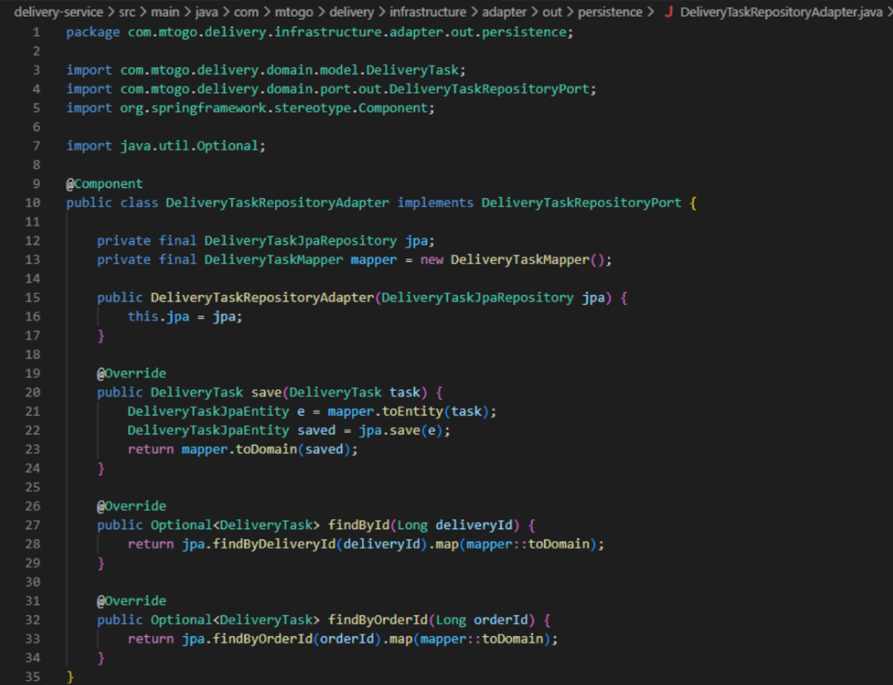

In the controller, this adapter is used to return DTOs to the frontend:

Benefits of Using the Adapter Pattern
* Loose Coupling: The API layer is independent of the database entity structure.
* Security: Sensitive or internal fields (like passwords or IDs) are hidden.                        	
* Maintainability: Entities can change internally without breaking the API.                                      	
* Reusability: The adapter can be reused across multiple services and controllers.                    	
* Clarity: DTOs give a clean, well-defined data structure for React frontend consumption.

Why this pattern fits MTOGO Application:
* The project aims to modernize a legacy monolithic system, not rewrite it entirely.
* The Adapter Pattern allowed gradual modernization by decoupling internal models from external APIs.
* It keeps the backend structure stable while letting the frontend evolve freely.
* It prepares the system for a future microservice migration, where adapters (mappers) will remain as boundaries between services.

#### The Singleton Pattern

The Singleton Pattern is applied automatically by the Spring Boot framework.
All @Service, @Repository, and @Controller classes  including the adapters are managed as singleton beans, ensuring only one instance of each exists across the application.
This pattern improves performance and consistency without requiring manual implementation.

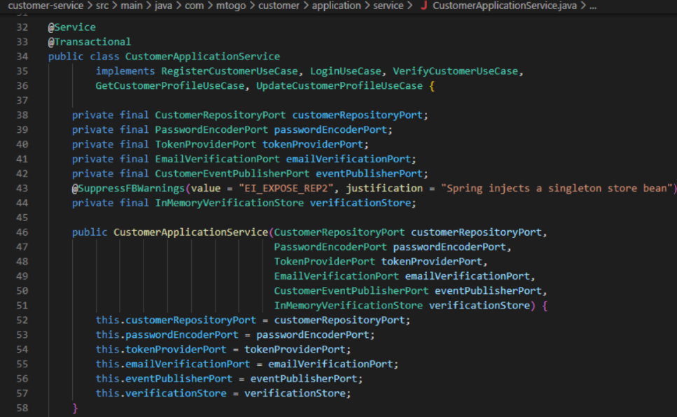

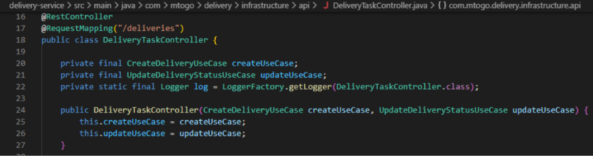

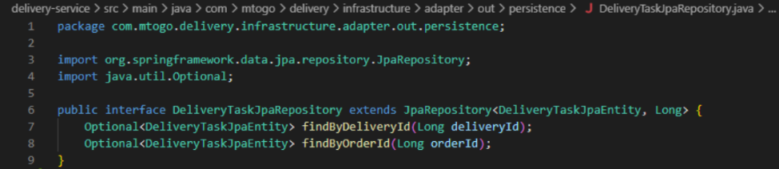

## CI/CD Pipeline 

Our CI/CD pipeline is implemented using **GitHub Actions** with three main workflows that automate build, test, and deployment processes for our microservices architecture.

### Workflows

#### 1. CI - Build and Test (`ci-build-test.yml`)
**Triggers:** Push to `main`, `develop`, `feature/**` branches; Pull requests to `main`, `develop`

**Process:**
- Detects changed services using path filters to optimize build times
- **Only services with changes are tested** - minimizes CI/CD load and speeds up builds
- Feature branch naming (`feature/<description>`) enables selective testing and parallel development
- Builds shared `Exam-logging` library dependency first
- Runs parallel builds for affected services only
- Executes unit tests with Maven
- Generates test coverage reports (JaCoCo)
- Uploads build artifacts for deployment

**Services:** customer, ordering, delivery, fulfillment, financial, restaurant, gateway

#### 2. CD - Docker Build & Push (`docker-build-push.yml`)
**Triggers:** Push to `main`, version tags (`v*.*.*`), manual dispatch

**Process:**
- Builds Docker images for all microservices
- Uses Docker Buildx for multi-platform support
- Pushes images to GitHub Container Registry (GHCR)
- Tags images with version, branch, SHA, and `latest`
- Supports manual selection of specific services to build

**Image naming format:**

- `ghcr.io/<owner>/mtogo-<service-name>:<branch-name>` (e.g., `feature/add-payment`, `main`, `develop`)

#### 3. PR Validation (`pr-validation.yml`)
**Triggers:** Pull requests to `main`, `develop` (open, sync, reopen)

**Checks:**
- Code quality analysis (Checkstyle)
- Static analysis (SpotBugs)
- Security vulnerability scanning (OWASP Dependency Check)
- Dockerfile linting (Hadolint)
- Uploads security reports as artifacts

### Deployment
Services are containerized and orchestrated using Docker Compose (`docker-compose.all.yml`) with:
- RabbitMQ for message brokering
- MySQL databases per service
- Networked microservices architecture

#### Image of CI/CD Pipeline using Github Actions. 

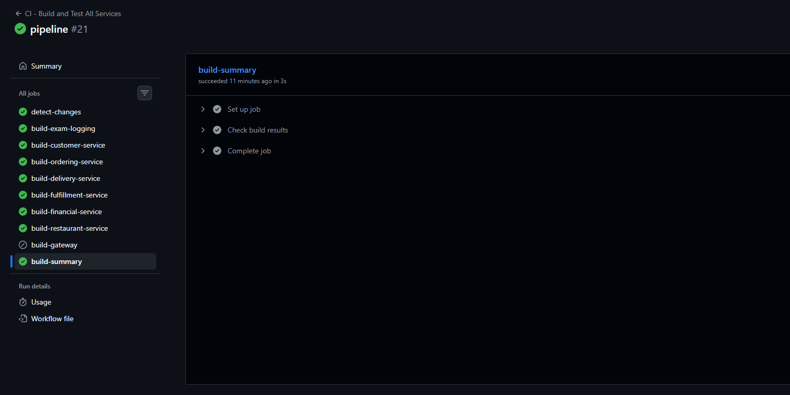
